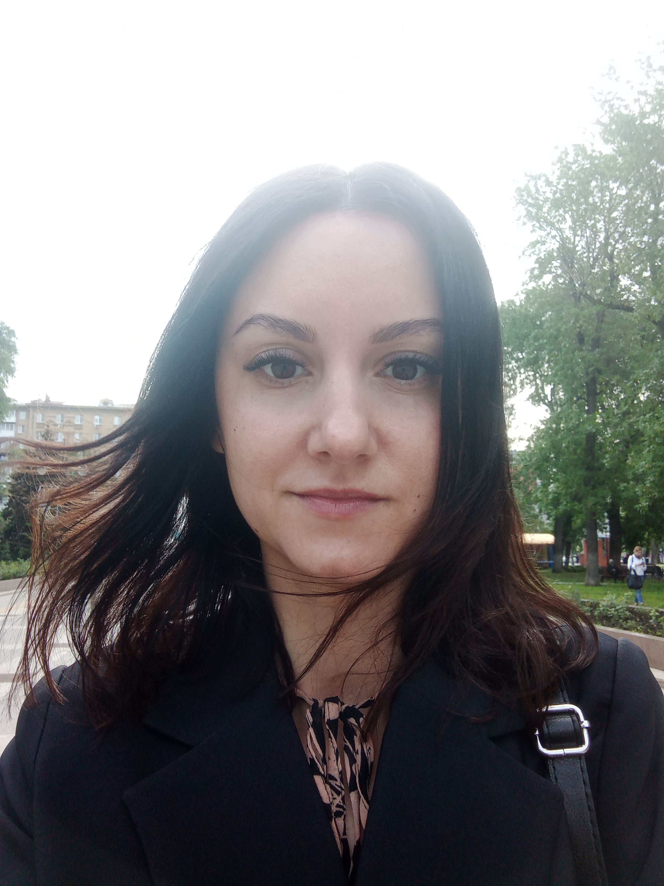

# Обо мне...

Привет! Меня зовут **Олеся Морозова**. Уже более 8 лет я работаю в государственном внебюджетном фонде. 

Меня многому научила эта работа:
- самостоятельности
- ответственности
- стрессоустойчивости

Я развила в себе такие важные качества, как:
1. целеустремленность
2. коммуникабельность
3. способность самостоятельно принимать решения

## Но по-настоящему я мечтаю... 
стать тестировщиком ПО, где смогу в полную силу раскрыть свои сильные стороны:
- внимательность
- обучаемость
- умение адаптироваться
- способность работать в команде

## Я буду продолжать работать над собой...
потому что нас определяет то, что мы делаем **КАЖДЫЙ** день!
